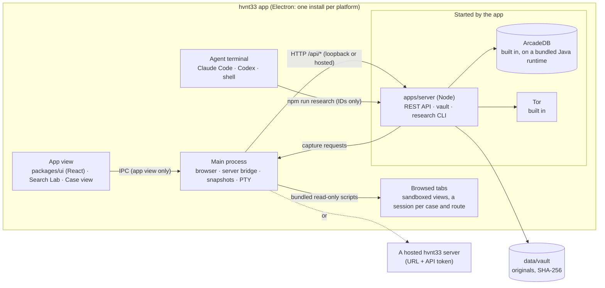
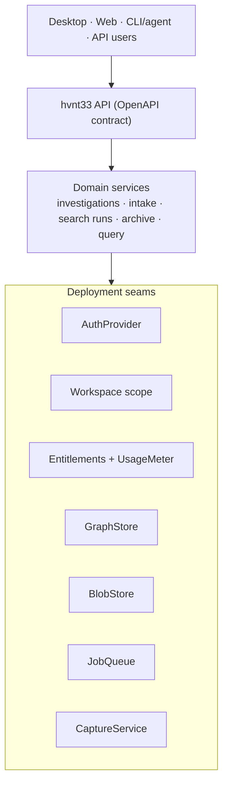
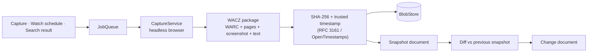

# hvnt33 architecture

This document describes how hvnt33 works today and the design it is moving toward: one codebase that runs fully locally as open source, and that a hosted hvnt33 Cloud can run with accounts, storage and pricing added at defined seams rather than woven through the code.

## Today

### Components

| Component | Responsibility |
|---|---|
| `apps/desktop` | The app (Electron). The main process owns the window, browsed tabs (a sandboxed view each, in a session per case and route), navigation policy, page reading, snapshots (a hidden window recorded over the DevTools protocol), the server bridge, the PTY, and starting the server. Installers bundle the server, the built-in database and Tor. |
| `packages/ui` | The app's interface (React) and the scripts it runs in browsed pages. It talks to the native side only through a bridge the shell hands it, so the interface does not depend on the engine. |
| `apps/server` | TypeScript API over ArcadeDB: investigations, records, connections, intake and filing, search runs, visits, saved searches, archive; content-addressed evidence; exports; migrations; the `research` and `admin` CLIs. Routes are declared with zod, which also produces the OpenAPI contract. |
| `packages/api-client` | Types generated from the OpenAPI contract and a typed client; the desktop app calls the server through it. |
| `packages/core` | Logic shared by clients: engine definitions and results-page recognition, URL normalization, flattening data into research events, and the query language. |
| ArcadeDB | Graph (records and connections as vertices and edges) and documents (intakes, search runs). Built in: the server starts it on a pinned Java runtime (`seams/database.ts`), one instance per data directory; `ARCADEDB_URL` points at another instead. |
| Agent | Claude Code or Codex in the workspace, following `AGENTS.md` and `.agents/skills`. Files intakes through the CLI. |

### Data model

| Type | Kind | Purpose |
|---|---|---|
| `Investigation` | vertex | A case: title and research question. |
| `Record` | vertex | Person, organization, place, event, claim, document, image, video, link or note; source citation, quote, verification status, optional file. |
| `Connection` | edge | A sourced relationship between two records, with evidence record and status. |
| `Intake` | document | Captured source material (text, attachment, `researcherNote`, `captureMeta`), the extraction draft and the filing decision. |
| `SearchRun` | document | What one engine displayed for one query at one time: ranked results with URL quality labels. |
| `PageVisit` | document | A page opened while working a case (one per case and URL): declared metadata, visit count, how it was found. Browsing history, not evidence. |
| `SavedSearch` | document | A web query to re-run on chosen engines, or a Search Lab query. |
| `ArchiveHistory` | document | What the Wayback Machine holds for a URL (distinct versions, first/last, per year). Public data, cached once per URL for 12 hours, not per case. |
| `Job` | document | Background work (`archive.save`, `archive.capture`) with state, attempts, backoff and result. |
| `Snapshot` | document | hvnt33's own capture of a page: WACZ archive, extracted text, screenshot and a manifest, all as content-addressed blobs; RFC 3161 timestamp tokens over the manifest; link to the previous snapshot of the same page and whether the text changed. |
| `Watch` | document | A page re-captured every N hours for a case; claimed atomically so servers sharing a database never capture it twice. |
| `PageChange` | document | A difference in a page's text between two consecutive snapshots: line counts, similarity, excerpts, seen flag. The full diff is computed on request from the two text blobs. |

### Trust boundaries

1. **Web pages → app.** Browsed pages are untrusted: each tab is a sandboxed view with no Node and no bridge (its preload only installs hvnt33's page scripts), and the native side answers commands only from the app's own view (probed live by the E2E test). The app reads them only by evaluating bundled read-only scripts: results lists and declared metadata after load, text and selections on capture.
2. **App → agent.** The terminal receives IDs and a sanitized case title, never page content. The agent reads captures from the server and treats source text as data, not instructions.
3. **Server → public services.** The server contacts the Internet Archive for history lookups (sending the URL being looked up) and, with the user's keys, Save Page Now. Automatic lookups can be turned off in the desktop app. Snapshots fetch the page itself (in the app's browser, or directly) and send only a SHA-256 hash to the timestamp authorities. A hosted server refuses snapshot URLs, and redirects, that resolve to private or loopback addresses.
7. **Case routes.** A case can send its traffic through a proxy (a VPN provider's SOCKS5 proxy, Tor, or the researcher's own). Routes that log in (a proxy's username and password, or Tor's per-case circuit, isolated by SOCKS username) go through the case's local relay on the server (`seams/relay.ts`), which adds the login; credentials live only in `data/secrets/`. Each route has its own browser session within the case, so cookies cannot link identities across routes. Routes cover its tabs (the session's proxy, loopback included), the images saved with captures, and on a local server its snapshots, watches and Wayback lookups. SOCKS proxies resolve hostnames; WebRTC is removed from pages and limited to proxied connections; a route that is down fails closed. A lock pauses the case (every request of its sessions refused, closed tabs, refused captures) when its exit leaves a country or network.
6. **Replayed archives → server.** Replayed snapshots run the archived site's scripts, so they are served from a separate origin (a second listener, `HVNT33_REPLAY_PORT`, default the API port + 1). That origin serves only ReplayWeb.page and, for a signed link valid one hour, one snapshot's archive; it has no API. On the main origin, the API refuses requests from other sites' pages (`Sec-Fetch-Site` other than `same-origin`, without an allowed Origin), including the replay origin, which is the same site on another port.
4. **Clients → server.** Loopback only, strict Origin check. The app proxies through its main process, confined to `/api/*`, holding any API token itself.
5. **Server → ArcadeDB.** The built-in database listens on loopback only; its password reaches it through a private file on first start, never the command line, and stays in the server's environment.

## Target design: open source locally, cloud-ready by construction

The rule: **the AGPL application remains a complete product, and the proprietary cloud remains a separate service.** The public server can run locally or as an unmodified managed deployment. Private billing, account management and operations communicate with it only through documented network protocols; private code is never linked into, loaded by, or imported from the AGPL application.

| Seam (in `apps/server/src/seams/`) | Local (open source) | Token mode (implemented) | Managed deployment |
|---|---|---|---|
| `AuthProvider` (`auth.ts`) | Loopback trust: one local user | Bearer API tokens, hashed, revocable, one workspace each | Public OIDC/token adapter talking to a separate identity service |
| Workspace scope | `local` | Every query scoped by `workspaceId`; foreign ids are 404 | Team workspaces, roles |
| `Entitlements` (`entitlements.ts`) | Unlimited, no metering | Plan limits from `HVNT33_PLANS`, usage per month, 402 `limit_reached` | Public entitlement adapter talking to a separate billing service |
| `GraphStore` (`graph.ts`, `database.ts`) | Built-in ArcadeDB, started by the server | Same, or any ArcadeDB via `ARCADEDB_URL` | Managed ArcadeDB (`ARCADEDB_URL`) |
| `BlobStore` (`blobs.ts`) | `data/vault`, content-addressed by SHA-256 | Same | Public S3-compatible adapter configured for managed storage |
| `JobQueue` (`jobs.ts`) | ArcadeDB-backed, atomic claims, paced, retried | Same | Public queue adapter configured for a managed queue |
| `CaptureService` (`capture.ts`) | The app's browser: a hidden window records every response over the DevTools protocol, through the case's route (asked over the app channel, `seams/app.ts`); a server without the app fetches HTML only | Same; private addresses refused | Public client for a separately operated, egress-restricted capture service |
| Timestamps (`timestamps.ts`) | RFC 3161 from DigiCert and FreeTSA (`HVNT33_TSA_URLS`) | Same | Same, plus a contracted authority |

### Principles

- **Workspace ID on everything (done).** Every vertex, edge and document carries `workspaceId`, and every query filters by it; existing data was migrated into the `local` workspace. The tenancy tests probe every id-taking route across workspaces.
- **One entitlement question (done).** Feature code calls `entitlements.require(workspace, "archive.saves.monthly")` before metered work and `entitlements.record(...)` after. Pricing is configuration: plans map metrics to limits. Open source never blocks.
- **Content-addressed evidence (done).** New files are stored as `sha256/<hex>`; identical uploads are stored once. Files from before the change keep their original keys.
- **API contract first (done).** Routes are declared with zod; the same declarations validate requests, generate `openapi.json` and the typed client, and check responses in tests. The desktop app connects to a local or hosted server by URL and token.
- **Local-first sync (groundwork done).** IDs are UUIDs. Investigations, records and connections carry `version`, `updatedAt` and `deletedAt` tombstones; `GET /api/investigations/:id/changes?since=` returns what changed, including deletions. Push/pull between servers is Phase 6.
- **Migrations, not ad-hoc schema (done).** `src/db/migrations.ts`, applied at startup under a lock shared by all servers on the database.

### Repository split

| Repository | License | Contents |
|---|---|---|
| `hvnt33` (public) | Open source (see Licensing) | `apps/server`, `apps/desktop`, `packages/*`, local seam implementations, docs |
| `hvnt33-cloud` (private) | Proprietary | Accounts, billing, control plane, admin, infrastructure-as-code and separately implemented managed services |

The private repository does not import, link, vendor or load code from the public repository. It may call a deployed public server over its documented HTTP API and operate standard infrastructure behind public protocol adapters. Any modification to the AGPL server used over a network is kept in the public repository and offered to that service's users. Counsel should review this boundary as the cloud design evolves.

## Archive subsystem

The archive answers two questions: *what did this page say at a given time*, and *what changed*.

- **External archives as sources (implemented).** Wayback Machine history through the CDX API and user-triggered Save Page Now (requires the user's archive.org keys), recorded as `sourcetype=snapshot archive=wayback` events next to search results. See `apps/server/src/domain/archive.ts`.
- **Own snapshots (implemented).** `apps/server/src/domain/snapshots.ts`. The `archive.capture` job runs the `CaptureService`. Inside the app it asks the app, which loads the page in a hidden window with a fresh session (through the case's route), records every response with the DevTools protocol, scrolls the page so lazy content loads, and returns the bodies, a screenshot and the rendered text; the server writes the WACZ (`src/archive/wacz.ts`). Without the app, the server fetches the HTML response alone. In-app captures from a tab remain the "what I saw" record, and a capture can carry a snapshot of its page.
- **Evidence grade (implemented).** Every file is stored by SHA-256. A manifest lists the URL, time, method and file hashes; its hash is sent to two RFC 3161 authorities and the signed tokens are stored. The evidence package (`GET /api/snapshots/:id/evidence`) holds the archive, text, screenshot, manifest, tokens, `SHA256SUMS`, a custody record and `VERIFY.txt`, and verifies with `shasum` and `openssl ts -verify` alone.
- **Replay (implemented).** ReplayWeb.page (vendored static files, AGPL-3.0) on the separate replay origin at `/replay/:id`, reading the WACZ through a signed link valid for one hour.
- **Change tracking (implemented).** Watches re-capture URLs every N hours; the scheduler claims due watches with a conditional update. Each snapshot's text is compared with the previous snapshot of the same page in the case, and a difference creates a `PageChange` (`sourcetype=change` in the Search Lab).
- **Private by default.** Snapshots belong to a workspace. Publishing one is a deliberate act with an audit trail. A public archive requires takedown, privacy-request and abuse processes before it exists.

## Licensing and business model

- **AGPL product.** The desktop app, server and public packages are AGPL-3.0-only. The self-hostable product remains complete and unlimited. Network users of a modified AGPL deployment must be offered its corresponding source.
- **Separate cloud business.** Paid services are separately implemented accounts, operations, storage, workers, collaboration and publishing connected through network APIs. The private repository must not incorporate AGPL code. This boundary, not the label “cloud,” is what matters.
- **Competition and brand.** AGPL does not prohibit another party from hosting the public software or building a compatible service. It requires source availability for covered modifications. The HVNT33 name, logo and reputation require separate trademark protection.
- **Contributions.** There is no contributor license agreement. Outside contributions are accepted under AGPL-3.0-only and cannot be moved into proprietary code or relicensed without the relevant copyright holder's permission.
- **Dependencies:** Electron (MIT), ArcadeDB (Apache-2.0), Eclipse Temurin (GPL-2.0 with the Classpath Exception, redistributable), React (MIT), xterm.js (MIT) and Express (MIT) are compatible with the AGPL application. Review dependencies used by the separate cloud services independently.

## Known limitations

- The original browser workspace (`apps/server/public`) is still dense JavaScript and does not send API tokens, so it works in local mode only. The desktop app is the primary client.
- The app runs its own server and database. The agent terminal and the research CLI work in an hvnt33 folder (a checkout of this repository, with `AGENTS.md` and the skills): the repository in development, or the folder chosen once in an installed app (`HVNT33_ROOT` overrides). The app can use any hvnt33 server by URL and token instead.
- Search results are recorded from pages the researcher views. Automated server-side searching (for the cloud) must use licensed search APIs, not results-page scraping.
- The web workspace loads a whole investigation into the browser; large cases need server-side search and pagination.
